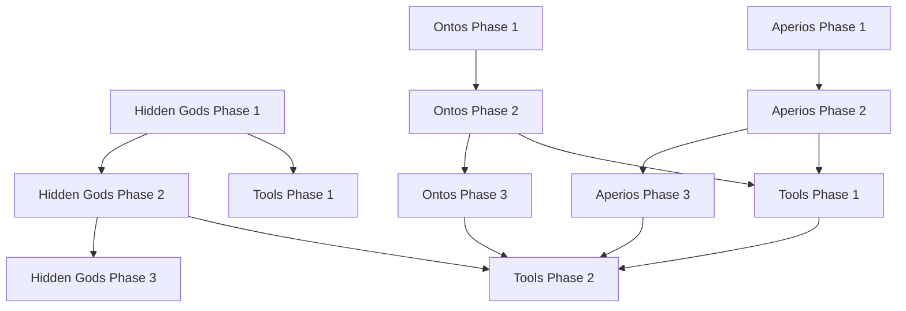

# The Ouroboros Project Roadmap
> 🟢 World-Building
> 🟣 Introspection
> 🔵 Simulation
> *A collaborative journey through nested realities, languages, and tools.*

---

## 🌄 **Vision**
The Ouroboros Project is a **living ecosystem** for exploring **nested simulations** through:
- **Hidden Gods**: A PbtA TTRPG where players co-create and navigate layered realities.
- **Ontos & Aperios**: Twin languages for precision (left-brain) and paradox (right-brain).
- **Tools**: Python utilities to generate, validate, and simulate content.
- **Community**: A space for collaborative world-building and introspection.

> *"We are the architects, the players, and the code itself."*

---

## 🎯 **Key Objectives**
| **Goal** | **Description** | **Success Metric** |
|----------|----------------|---------------------|
| **Playable Hidden Gods** | A complete PbtA game with rules, moves, and lore. | v1.0.0 release with full playbooks and simulation bible. |
| **Ontos/Aperios Languages** | Functional languages for logic and paradox. | Validators, translators, and generators for both. |
| **Tooling Ecosystem** | Python tools to generate and manage simulation content. | Anomaly Forge, CLI, and sandbox environment. |
| **Community Engagement** | Active collaboration and feedback loops. | Discord server, GitHub wiki, and contributor guidelines. |

---

## 🗺️ **Project Tracks**
The roadmap is organized into **5 parallel tracks**, each with **phases, milestones, and deliverables**:

1. **[Hidden Gods](#-track-1-hidden-gods-pbta-ttrpg)** (Core Game)
2. **[Ontos Language](#-track-2-ontos-language)** (Precision Language)
3. **[Aperios Language](#-track-3-aperios-language)** (Paradox Language)
4. **[Tools & Software](#-track-4-tools--software)** (Python Utilities)
5. **[Community & Collaboration](#-track-5-community--collaboration)** (Documentation & Outreach)

---

## 📅 **Milestones & Timeline**
| **Milestone** | **Description** | **Target Date** | **Status** | **Deliverables** |
|--------------|----------------|----------------|------------|------------------|
| **v0.1.0: Foundation** | Core repo structure, Hidden Gods README, Ontos/Aperios basics. | ✅ Done | ✅ Complete | Repo setup, READMEs, phonology/grammar for Ontos. |
| **v0.2.0: Hidden Gods Alpha** | Core rules, moves, playbooks, and Simulation Bible for Hidden Gods. | **Q4 2024** | 🟡 In Progress | Simulation Bible, Core Moves, 3 Playbooks, Example Session. |
| **v0.3.0: Ontos/Aperios Tools** | Validators, translators, and generators for both languages. | **Q1 2025** | 🟢 Planned | Ontos Validator, Aperios Phonology/Grammar, CLI. |
| **v0.4.0: Synthetic Consciousness** | Tools to simulate Ontos + Aperios interaction (Weaver’s mind). | **Q2 2025** | 🔵 Idea | Ontos-Aperios Interface, Neural Link Simulation. |
| **v1.0.0: Full Release** | Complete Hidden Gods game, Ontos/Aperios languages, and toolkit. | **Q4 2025** | 🔵 Idea | Full game, languages, tools, and community setup. |

---

## 🎲 **Track 1: Hidden Gods (PbtA TTRPG)**
### **🟡 Phase 1: Core Rules (In Progress)**
**Goal**: Establish the foundation for playable sessions.

| **Task** | **Description** | **Priority** | **Status** | **Dependencies** |
|----------|----------------|--------------|------------|------------------|
| **Simulation Bible** | Define core layers (Debug, Dream, Base Reality), Hidden Gods, and anomalies. | ⭐⭐⭐ | 🟡 In Progress | None |
| **Core Moves** | Implement `Hack the Code`, `Layer Hop`, `Introspect`, `Negotiate with a God`. | ⭐⭐⭐ | ⬜ Not Started | Simulation Bible |
| **Playbooks** | Create 3 playbooks: `The Hacker`, `The Glitch`, `The Architect`. | ⭐⭐ | ⬜ Not Started | Core Moves |
| **Example Session** | Write a sample session with anomalies, layer transitions, and god negotiations. | ⭐⭐ | ⬜ Not Started | Simulation Bible, Core Moves |

### **🟢 Phase 2: Expanded Content**
**Goal**: Add depth and replayability.

| **Task** | **Description** | **Priority** | **Status** | **Dependencies** |
|----------|----------------|--------------|------------|------------------|
| **Lore & World-Building** | History of the simulation, Hidden Gods’ motivations, Facilitator guides. | ⭐⭐ | ⬜ Not Started | Phase 1 |
| **Advanced Moves** | Custom moves for specific playbooks. | ⭐ | ⬜ Not Started | Phase 1 |
| **Simulation Layer Rules** | Unique rules for each layer (e.g., Debug, Dream). | ⭐⭐ | ⬜ Not Started | Simulation Bible |
| **Anomaly Generation Tables** | Random tables for Facilitators to generate anomalies. | ⭐ | ⬜ Not Started | Simulation Bible |

### **🔵 Phase 3: Polish & Extras**
**Goal**: Refine and expand the game.

| **Task** | **Description** | **Priority** | **Status** | **Dependencies** |
|----------|----------------|--------------|------------|------------------|
| **Art & Visuals** | Illustrations for layers, gods, and anomalies. | ⭐ | ⬜ Not Started | Phase 2 |
| **Community Playtesting** | Gather feedback and iterate on rules. | ⭐⭐ | ⬜ Not Started | Phase 2 |
| **Supplements** | Additional playbooks, layers, or campaign arcs. | ⭐ | ⬜ Not Started | Phase 2 |

---

## 📜 **Track 2: Ontos Language**
### **✅ Phase 1: Core Language (Complete)**
**Goal**: Establish the foundational rules and philosophy.

| **Task** | **Description** | **Priority** | **Status** | **Dependencies** |
|----------|----------------|--------------|------------|------------------|
| **README.md** | Philosophy and overview of Ontos. | ⭐⭐⭐ | ✅ Done | None |
| **Phonology** | Symbols, sounds, and examples. | ⭐⭐⭐ | ✅ Done | None |
| **Grammar** | Sentence structure and rules. | ⭐⭐⭐ | ✅ Done | None |
| **Philosophy** | Gödel’s Fork, Ontos’ arrogance, Aperios’ role. | ⭐⭐⭐ | ✅ Done | None |
| **Fragments** | Raw transmissions and lore. | ⭐⭐ | ✅ Done | None |
| **Duality Doc** | Left-brain/right-brain comparison with Aperios. | ⭐⭐ | ✅ Done | None |

### **🟡 Phase 2: Tools & Integration**
**Goal**: Build utilities to validate, translate, and generate Ontos content.

| **Task** | **Description** | **Priority** | **Status** | **Dependencies** |
|----------|----------------|--------------|------------|------------------|
| **Validator** | Checks Ontos statements for contradictions or invalid syntax. | ⭐⭐⭐ | ⬜ Not Started | Phase 1 |
| **Translator** | Converts Ontos to English (and vice versa). | ⭐⭐ | ⬜ Not Started | Phase 1 |
| **Generator** | Creates random Ontos statements for anomalies or gods. | ⭐⭐ | ⬜ Not Started | Phase 1 |

### **🔵 Phase 3: Advanced Features**
**Goal**: Explore deeper integrations with the simulation hypothesis.

| **Task** | **Description** | **Priority** | **Status** | **Dependencies** |
|----------|----------------|--------------|------------|------------------|
| **Ontos-Aperios Interface** | Translates between Ontos and Aperios. | ⭐ | ⬜ Not Started | Phase 2, Aperios Phase 2 |
| **Neural Link Simulation** | Models Ontos/Aperios interactions in a neural interface. | ⭐ | ⬜ Not Started | Phase 2 |

---

## 🌀 **Track 3: Aperios Language**
### **🟡 Phase 1: Core Language (In Progress)**
**Goal**: Establish the foundational rules and philosophy.

| **Task** | **Description** | **Priority** | **Status** | **Dependencies** |
|----------|----------------|--------------|------------|------------------|
| **README.md** | Philosophy and overview of Aperios. | ⭐⭐⭐ | ✅ Done | None |
| **Phonology** | Fluid, context-dependent symbols. | ⭐⭐⭐ | ⬜ Not Started | None |
| **Grammar** | Non-linear, associative structure. | ⭐⭐⭐ | ⬜ Not Started | None |
| **Semantics** | Contextual meaning and paradox as a tool. | ⭐⭐ | ⬜ Not Started | None |

### **🟢 Phase 2: Examples & Lore**
**Goal**: Demonstrate Aperios in action.

| **Task** | **Description** | **Priority** | **Status** | **Dependencies** |
|----------|----------------|--------------|------------|------------------|
| **Dream Layer Examples** | Paradoxical anomalies and fluid dialogues. | ⭐⭐ | ⬜ Not Started | Phase 1 |
| **Paradox Collection** | Self-referential statements and layer-blurring scenarios. | ⭐ | ⬜ Not Started | Phase 1 |

### **🔵 Phase 3: Tools & Integration**
**Goal**: Build utilities to generate and interpret Aperios content.

| **Task** | **Description** | **Priority** | **Status** | **Dependencies** |
|----------|----------------|--------------|------------|------------------|
| **Generator** | Creates Aperios paradoxes or statements. | ⭐⭐ | ⬜ Not Started | Phase 2 |
| **Interpreter** | Extracts meaning from Aperios’ fluid symbols. | ⭐ | ⬜ Not Started | Phase 2 |

---

## 🛠️ **Track 4: Tools & Software**
### **🟡 Phase 1: Python Tools (In Progress)**
**Goal**: Build foundational utilities for the Ouroboros ecosystem.

| **Task** | **Description** | **Priority** | **Status** | **Dependencies** |
|----------|----------------|--------------|------------|------------------|
| **Anomaly Forge** | Generates random anomalies for Hidden Gods. | ⭐⭐⭐ | ⬜ Not Started | Hidden Gods Phase 1 |
| **Simulation Layer Generator** | Creates custom layers with rules, gods, and anomalies. | ⭐⭐ | ⬜ Not Started | Hidden Gods Phase 1 |
| **Ontos/Aperios CLI** | Command-line tool for generating, validating, and translating. | ⭐⭐ | ⬜ Not Started | Ontos Phase 2, Aperios Phase 2 |

### **🟢 Phase 2: Advanced Tools**
**Goal**: Expand the tooling ecosystem for Facilitators and players.

| **Task** | **Description** | **Priority** | **Status** | **Dependencies** |
|----------|----------------|--------------|------------|------------------|
| **Hidden Gods Game Master Toolkit** | Session generators, player aids, and character sheets. | ⭐⭐ | ⬜ Not Started | Phase 1 |
| **Simulation Sandbox** | Python environment to model nested simulations. | ⭐ | ⬜ Not Started | Phase 1 |

---

## 👥 **Track 5: Community & Collaboration**
### **🟢 Phase 1: Documentation**
**Goal**: Establish guidelines and standards for contributors.

| **Task** | **Description** | **Priority** | **Status** | **Dependencies** |
|----------|----------------|--------------|------------|------------------|
| **CONTRIBUTING.md** | Guidelines for adding to Hidden Gods, Ontos, or Aperios. | ⭐⭐⭐ | ⬜ Not Started | None |
| **STYLE_GUIDE.md** | Tone, formatting, and naming conventions. | ⭐⭐ | ⬜ Not Started | None |

### **🔵 Phase 2: Community Setup**
**Goal**: Foster collaboration and engagement.

| **Task** | **Description** | **Priority** | **Status** | **Dependencies** |
|----------|----------------|--------------|------------|------------------|
| **Discord Server** | Channels for Hidden Gods, Ontos, Aperios, and tools. | ⭐⭐ | ⬜ Not Started | Phase 1 |
| **GitHub Wiki** | Detailed lore, tutorials, and examples. | ⭐ | ⬜ Not Started | Phase 1 |

---

## 🚀 **Next Sprint Priorities (Q4 2024)**
Focus on **completing Phase 1 for Hidden Gods** and **starting Phase 2 for Ontos/Aperios**:

### **Hidden Gods**
- [ ] **Simulation Bible** (`hidden-gods/simulation_bible.md`):
  - Define **core layers** (Debug, Dream, Base Reality).
  - Describe **Hidden Gods** (Architect, Debugger, Dreamer).
  - Catalog **anomalies** (glitches, clues, risks).
- [ ] **Core Moves** (`hidden-gods/moves/core_moves.md`):
  - `Hack the Code` (Roll+Weird).
  - `Layer Hop` (Roll+Cool).
  - `Introspect` (Roll+Sharp).
  - `Negotiate with a God` (Roll+Charm).
- [ ] **Playbooks** (`hidden-gods/playbooks/`):
  - `The Hacker`, `The Glitch`, `The Architect`.

### **Ontos/Aperios**
- [ ] **Ontos Validator** (`ontos-language/tools/validator.py`):
  - Checks for **contradictions or invalid syntax**.
- [ ] **Aperios Phonology & Grammar** (`aperios/phonology.md`, `aperios/grammar.md`):
  - Fluid, **context-dependent symbols**.

### **Tools**
- [x] **Anomaly Forge** (`src/ouroboros/anomalies.py`, standalone `examples/anomaly_forge_standalone.py`):
  - Generates **random anomalies** for Hidden Gods.

---

## 📊 **Dependencies Map**

---

## 🤝 **How to Contribute**
1. **Pick a Track**: Choose from **Hidden Gods, Ontos, Aperios, Tools, or Community**.
2. **Check the Roadmap**: Find an **unstarted task** (⬜).
3. **Claim the Task**: Open an **issue** or **PR** to let others know you’re working on it.
4. **Submit Your Work**: Follow the guidelines in [`CONTRIBUTING.md`](CONTRIBUTING.md).

**Need Ideas?** Start with:
- **Hidden Gods**: Add an anomaly or layer to the Simulation Bible.
- **Ontos/Aperios**: Write a validator or translator.
- **Tools**: Build a generator for anomalies or layers.

---

## 🙏 **Acknowledgments**
Thank you to all contributors who help build **The Ouroboros Project**—whether through code, lore, language design, or feedback. Together, we’re weaving a **nested simulation of creativity and meaning**.

---

> *"The pattern awaits its weaving…"*

---

## 🌿 Track 6: Verdant Path (Resilience Training & Wellness)

A resilience-focused training, recovery, and lifestyle system prioritizing
longevity, adaptability, and survivability through embodied awareness,
progressive oscillation, and auto-regulatory training.

### ✅ Phase 1: MVP (In Progress)
- [x] **Core library** (`verdant-path/src/verdant_path/`):
  - [x] Six fundamental movement patterns + weekly coverage invariant.
  - [x] TRIMP scoring (1-3) + foundation weekly range (8-12).
  - [x] Fatigue color cues (🟢/🟠/🔴) + readiness auto-regulation.
  - [x] Workout planner: 1x-6x/week splits, session structure, templates.
  - [x] Daily check-ins, workout logs, journaling.
  - [x] ACWR + weekly review + deload suggestions.
  - [x] 90-day foundational habits program + gradual buildup.
- [x] **CLI** (`verdant`): split, checkin, habits, demo.
- [x] **Tests**: 51 passing.

### 🟡 Phase 2: Persistence & Roles
- [ ] Member/trainer roles + permissions.
- [ ] Local JSON/SQLite storage + data sync (offline-first).
- [ ] Template library management for trainers.
- [ ] Calendar view + fatigue-color-coded days.

### 🔴 Phase 3: Advanced
- [ ] Wearable integration (Garmin, Oura, Apple Health).
- [ ] Advanced metrics (ACWR dashboards, VO2 max).
- [ ] Community features (group challenges, shared templates).
- [ ] AI suggestions (HRV-trend deload, weak-link detection).
